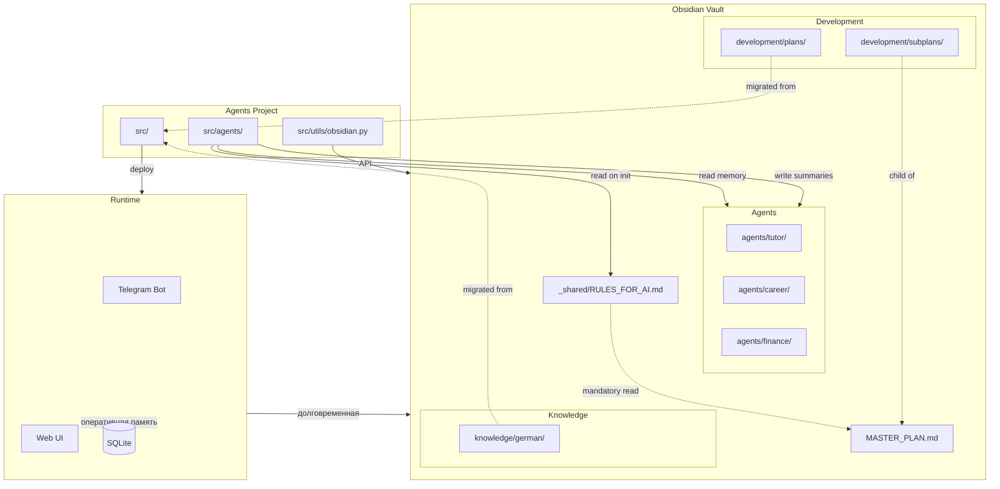
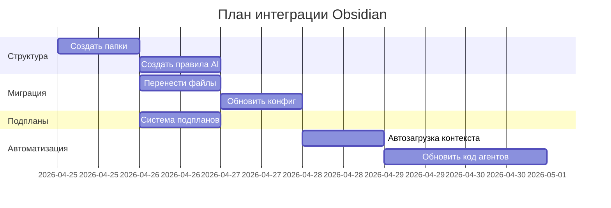

# План интеграции проекта Agents с Obsidian

**Дата создания:** 2026-04-25  
**Статус:** Draft  
**Цель:** Полная интеграция Obsidian как единого источника долговременной памяти и контекста для всех агентов и AI-ассистентов разработки

---

## 📋 Контекст проблемы

### Текущее состояние
- ✅ Obsidian vault существует: `/home/alex/Obsidian/01_Projects/Agents/`
- ✅ Syncthing синхронизирует: ноутбук ↔ VDS hub
- ✅ Агент [`tutor`](../Agents/src/agents/tutor.py:1) уже читает [`progress.md`](/home/alex/Obsidian/01_Projects/Agents/tutor/progress.md) и [`vocabulary.md`](/home/alex/Obsidian/01_Projects/Agents/tutor/vocabulary.md)
- ✅ Агент [`copilot`](../Agents/src/agents/copilot.py:1) пишет планы в [`00_Inbox/copilot/`](/home/alex/Obsidian/00_Inbox/copilot/)
- ⚠️ Остальные агенты (career, finance, secretary, ct2001, vds) НЕ интегрированы с Obsidian
- ⚠️ Файлы проекта разбросаны: [`Agents/plans/`](../Agents/plans/), [`Agents/knowledge/`](../Agents/knowledge/)
- ⚠️ Нет единой системы правил для AI-ассистентов разработки (Copilot в VS Code, Claude)
- ⚠️ [`MASTER_PLAN.md`](/home/alex/Obsidian/01_Projects/Agents/MASTER_PLAN.md:1) не имеет системы подпланов

### Что нужно достичь
1. **Единая структура знаний** — все агенты хранят данные в Obsidian
2. **Автоматическая инициализация** — агенты читают контекст при старте
3. **Правила для AI-моделей** — четкие инструкции для ассистентов разработки
4. **Система подпланов** — иерархическая декомпозиция задач от MASTER_PLAN
5. **Миграция без потерь** — перенос существующих md файлов с сохранением истории

---

## 🏗️ Архитектура целевой структуры Obsidian

```
/home/alex/Obsidian/01_Projects/Agents/
│
├── MASTER_PLAN.md                    # Главный план (уже существует)
├── Project_Agents.md                 # Инфраструктура (уже существует)
│
├── _shared/                          # 🆕 Общие для всех ресурсы
│   ├── RULES_FOR_AI.md              # Правила для AI-ассистентов разработки
│   ├── ARCHITECTURE.md              # Актуальная архитектура системы
│   ├── DEPLOYMENT_GUIDE.md          # Инструкции по деплою
│   └── GLOSSARY.md                  # Термины и концепции проекта
│
├── development/                      # 🆕 Файлы разработки проекта
│   ├── plans/                        # Перенос из Agents/plans/
│   │   ├── project_structure.md
│   │   ├── deployment_plan.md
│   │   ├── skills_architecture.md
│   │   └── agents/
│   │       └── german/
│   ├── subplans/                     # 🆕 Подпланы к MASTER_PLAN.md
│   │   ├── 00_INDEX.md              # Индекс всех подпланов
│   │   ├── phase2_obsidian_memory.md
│   │   ├── phase3_remaining_agents.md
│   │   ├── phase4_ct2001_worker.md
│   │   └── phase5_llm_intelligence.md
│   ├── decisions/                    # Архитектурные решения (ADR)
│   │   └── 000_decision_log.md
│   └── technical_debt.md             # Технический долг
│
├── methodology/                      # Методология (уже существует)
│   ├── 01_brainstorm.md
│   ├── 02_planning.md
│   ├── 03_tdd.md
│   └── 04_review.md
│
├── agents/                           # 🆕 Данные агентов (по папке на каждого)
│   ├── tutor/                        # Учитель немецкого (уже есть)
│   │   ├── progress.md
│   │   ├── vocabulary.md
│   │   └── learning_plan.md
│   ├── career/                       # 🆕 Карьерный коуч
│   │   ├── profile.md               # Резюме, навыки, цели
│   │   ├── job_search_log.md        # История поиска работы
│   │   └── interview_prep.md        # Подготовка к собеседованиям
│   ├── finance/                      # 🆕 Финансовый агент
│   │   ├── budget.md
│   │   ├── expenses/
│   │   └── analytics.md
│   ├── secretary/                    # 🆕 Личный секретарь
│   │   ├── tasks.md
│   │   ├── reminders.md
│   │   └── calendar_sync.md
│   ├── ct2001/                       # 🆕 HomeLab агент
│   │   ├── services_status.md
│   │   └── maintenance_log.md
│   └── vds/                          # 🆕 VDS агент
│       ├── docker_status.md
│       └── monitoring.md
│
├── knowledge/                        # 🆕 Общая база знаний
│   ├── german/                       # Перенос из Agents/knowledge/german/
│   │   ├── words/
│   │   ├── phrases/
│   │   ├── grammar/
│   │   └── _templates/
│   ├── career/
│   │   └── it_industry_notes.md
│   └── tech/
│       └── architecture_patterns.md
│
└── history/                          # 🆕 История взаимодействий
    ├── sessions/                     # Архив сессий агентов
    │   └── YYYY-MM-DD_agent_summary.md
    └── metrics/                      # Метрики использования
        └── monthly_stats.md
```

---

## 📦 Задача 1: Создать структуру папок в Obsidian

### Цель
Создать целевую структуру каталогов в Obsidian vault с сохранением существующих файлов.

### Шаги
1. **Создать новые папки:**
   ```bash
   cd /home/alex/Obsidian/01_Projects/Agents/
   mkdir -p _shared development/plans development/subplans development/decisions
   mkdir -p agents/{career,finance,secretary,ct2001,vds}
   mkdir -p knowledge/{career,tech} history/{sessions,metrics}
   ```

2. **Переименовать существующую папку туtor:**
   ```bash
   # tutor/ уже существует, оставляем как есть
   # Убедиться что там есть progress.md и vocabulary.md
   ```

3. **Создать индексные файлы:**
   - [`_shared/RULES_FOR_AI.md`](#задача-4-создать-файл-правил-для-ai-моделей) — создается в Задаче 4
   - [`development/subplans/00_INDEX.md`](#задача-6-создать-систему-подпланов) — создается в Задаче 6

### Критерии приемки
- ✅ Все папки созданы
- ✅ Существующие файлы не затронуты
- ✅ Структура соответствует схеме выше

---

## 📦 Задача 2: Перенести md файлы из проекта Agents

### Цель
Переместить файлы из [`Agents/plans/`](../Agents/plans/) и [`Agents/knowledge/`](../Agents/knowledge/) в Obsidian с сохранением структуры.

### Шаги

#### 2.1. Перенос планов разработки
```bash
SOURCE=/home/alex/Документи/ICH/SysVSC/Agents
TARGET=/home/alex/Obsidian/01_Projects/Agents/development/plans

# Копировать все md файлы из plans/
cp $SOURCE/plans/*.md $TARGET/

# Копировать подпапки
cp -r $SOURCE/plans/agents $TARGET/
cp -r $SOURCE/plans/copilot $TARGET/

# Проверить результат
ls -R $TARGET
```

Файлы для переноса:
- `deployment_plan.md` → `development/plans/`
- `german_obsidian_refactor_plan.md` → `development/plans/`
- `project_structure.md` → `development/plans/`
- `skills_architecture.md` → `development/plans/`
- `agents/german/implementation_instruction.md` → `development/plans/agents/german/`
- `copilot/project_roadmap.md` → `development/plans/copilot/`
- `copilot/runtime_transport_rollout.md` → `development/plans/copilot/`

#### 2.2. Перенос базы знаний немецкого
```bash
SOURCE=/home/alex/Документи/ICH/SysVSC/Agents/knowledge/german
TARGET=/home/alex/Obsidian/01_Projects/Agents/knowledge/german

# Копировать структуру
cp -r $SOURCE/* $TARGET/

# Структура:
# knowledge/german/
#   ├── learning_plan.md
#   ├── student_profile.md
#   └── _templates/
#       ├── learning_plan_template.md
#       ├── phrase_note_template.md
#       └── word_note_template.md
```

#### 2.3. Создать архив оригиналов
```bash
cd /home/alex/Документи/ICH/SysVSC/Agents
mkdir -p .archive/$(date +%Y%m%d)
mv plans/ .archive/$(date +%Y%m%d)/
mv knowledge/ .archive/$(date +%Y%m%d)/

# Создать символические ссылки для обратной совместимости
ln -s /home/alex/Obsidian/01_Projects/Agents/development/plans plans
ln -s /home/alex/Obsidian/01_Projects/Agents/knowledge knowledge

# Обновить .gitignore
echo "plans" >> .gitignore
echo "knowledge" >> .gitignore
```

### Критерии приемки
- ✅ Все md файлы перенесены в Obsidian
- ✅ Оригиналы сохранены в `.archive/`
- ✅ Созданы символические ссылки для совместимости
- ✅ `.gitignore` обновлен

---

## 📦 Задача 3: Обновить пути в конфигурации проекта

### Цель
Изменить пути к Obsidian в конфигурационных файлах и коде.

### Шаги

#### 3.1. Обновить [`config.py`](../Agents/config.py:1)
```python
# Текущее состояние (строка 9):
obsidian_vault_path: str = ""

# Новое состояние:
obsidian_vault_path: str = "/home/alex/Obsidian"  # Базовый путь к vault
obsidian_project_path: str = "01_Projects/Agents"  # Путь к проекту внутри vault
```

#### 3.2. Обновить [`src/config.py`](../Agents/src/config.py:44)
```python
# Текущее (строка 44):
OBSIDIAN_VAULT = os.environ.get("OBSIDIAN_VAULT_PATH", "/home/alex/Obsidian")

# Добавить:
OBSIDIAN_PROJECT = Path(OBSIDIAN_VAULT) / "01_Projects" / "Agents"

# Экспортировать:
__all__ = [
    "GEMINI_API_KEY", "LOCAL_MODEL_URL", "LOCAL_MODEL_NAME",
    "OBSIDIAN_VAULT", "OBSIDIAN_PROJECT",  # <-- добавить
    "SQLITE_DB_PATH", "get_effective_settings",
]
```

#### 3.3. Обновить [`src/utils/obsidian.py`](../Agents/src/utils/obsidian.py:10)
```python
# Добавить вспомогательную функцию для путей проекта
def get_project_path(relative_path: str) -> str:
    """
    Формирует путь относительно проекта Agents в Obsidian.
    relative_path: например 'agents/tutor/progress.md'
    Возвращает: '01_Projects/Agents/agents/tutor/progress.md'
    """
    return f"01_Projects/Agents/{relative_path}"
```

#### 3.4. Обновить агентов для использования нового API

**tutor.py** (уже использует правильные пути):
```python
# Строки 26-27 — оставить как есть
PROGRESS_PATH   = "01_Projects/Agents/tutor/progress.md"
VOCABULARY_PATH = "01_Projects/Agents/tutor/vocabulary.md"
```

**copilot.py** — обновить PLANS_DIR:
```python
# Текущее (строка 36):
PLANS_DIR = Path(OBSIDIAN_VAULT) / "00_Inbox" / "copilot"

# Изменить на:
from src.config import OBSIDIAN_PROJECT
PLANS_DIR = OBSIDIAN_PROJECT / "development" / "subplans" / "copilot_drafts"
```

### Критерии приемки
- ✅ [`config.py`](../Agents/config.py:1) содержит актуальный путь к Obsidian
- ✅ [`src/config.py`](../Agents/src/config.py:1) экспортирует `OBSIDIAN_PROJECT`
- ✅ [`src/utils/obsidian.py`](../Agents/src/utils/obsidian.py:1) имеет `get_project_path()`
- ✅ Агенты используют новые пути
- ✅ Все импорты исправлены

---

## 📦 Задача 4: Создать файл правил для AI-моделей

### Цель
Создать [`_shared/RULES_FOR_AI.md`](/home/alex/Obsidian/01_Projects/Agents/_shared/RULES_FOR_AI.md) с четкими инструкциями для AI-ассистентов разработки (Copilot в VS Code, Claude, etc).

### Содержимое файла

```markdown
---
title: Правила для AI-ассистентов разработки
version: 1.0.0
updated: 2026-04-25
mandatory_read: true
tags: [rules, ai, development, critical]
---

# Правила для AI-ассистентов разработки

> **КРИТИЧЕСКИ ВАЖНО:** Этот файл ОБЯЗАТЕЛЕН к прочтению при инициализации любого AI-ассистента, работающего с проектом Agents.

---

## 📍 Единственный источник истины

**MASTER_PLAN.md** — `/home/alex/Obsidian/01_Projects/Agents/MASTER_PLAN.md`

Этот файл содержит:
- Текущий статус всех фаз проекта
- Архитектурные решения
- Критические факты о деплое
- Лог всех сессий разработки

**ПРАВИЛО:** Перед началом работы ВСЕГДА читай MASTER_PLAN.md полностью.

---

## 🗂️ Структура проекта

### Файловая организация

```
/home/alex/Документи/ICH/SysVSC/Agents/  — код проекта (Git)
/home/alex/Obsidian/01_Projects/Agents/  — память и контекст (Syncthing)
```

**ПРАВИЛО:** 
- Код пишется в `/SysVSC/Agents/`
- Планы, документация, база знаний — в `/Obsidian/01_Projects/Agents/`
- Символические ссылки: `Agents/plans/` → `Obsidian/.../development/plans/`

### Структура Obsidian

См. полную схему в [`development/plans/obsidian_integration_master_plan.md`](obsidian_integration_master_plan.md).

Ключевые папки:
- **`_shared/`** — общие правила и архитектура
- **`development/`** — планы, подпланы, ADR
- **`agents/{name}/`** — данные конкретных агентов
- **`knowledge/`** — база знаний (немецкий, карьера, tech)
- **`methodology/`** — правила разработки

---

## 🔄 Workflow разработки

### Методология: Discuss → Approve → Execute

**Обязательные этапы:**

1. **Brainstorm** ([`methodology/01_brainstorm.md`](/home/alex/Obsidian/01_Projects/Agents/methodology/01_brainstorm.md))
   - НЕ писать код
   - Задавать вопросы
   - Предлагать альтернативы
   - Формировать дизайн

2. **Planning** ([`methodology/02_planning.md`](/home/alex/Obsidian/01_Projects/Agents/methodology/02_planning.md))
   - Детальный план
   - Разбивка на задачи
   - ЖДАТЬ одобрения пользователя

3. **TDD** ([`methodology/03_tdd.md`](/home/alex/Obsidian/01_Projects/Agents/methodology/03_tdd.md))
   - Сначала тесты
   - Потом реализация

4. **Review** ([`methodology/04_review.md`](/home/alex/Obsidian/01_Projects/Agents/methodology/04_review.md))
   - Проверка результата
   - Обновление документации

**ПРАВИЛО:** Нарушение этапов запрещено. Не переходи к следующему без явного одобрения.

---

## 🚀 Деплой и инфраструктура

### Три узла системы

| Узел | Роль | Алиас SSH |
|------|------|-----------|
| **Ноутбук** | Разработка, Gemma 4 CPU | `localhost` |
| **VDS** | Продакшн 24/7, Gemini API | `ssh vds` |
| **ct2001** | GPU воркер (P4000) | `ssh ct2001` |

### Workflow деплоя (железное правило)

```bash
# 1. Коммит на ноутбуке
git add . && git commit -m "..." && git push origin main

# 2. Пулл на VDS
ssh vds "cd ~/stack/Agents && git pull origin main"

# 3. Пересоздать контейнер
ssh vds "cd ~/stack/Agents && docker compose up -d --force-recreate ui"

# 4. Проверить логи
ssh vds "docker compose -f ~/stack/Agents/docker-compose.yml logs ui --tail=30"
```

**ПРАВИЛО:** Никогда не использовать `scp` или `docker cp` для обновления кода. Только Git.

### Пути в контейнере

```
/app/                          — код проекта
/app/data/                     — SQLite базы (volume: ./app_data:/app/data)
/app/obsidian/                 — Obsidian vault (volume: ./obsidian:/app/obsidian)
```

**ПРАВИЛО:** В контейнере OBSIDIAN_VAULT_PATH=/app/obsidian

---

## 🧠 Память агентов

### Двухслойная архитектура

1. **Оперативная (SQLite):**
   - Путь: `/app/data/conversations.sqlite`
   - Режим: WAL
   - Авто-триминг: 500 сообщений/агент
   - Модуль: [`src/db/conversations.py`](../../Agents/src/db/conversations.py)

2. **Долговременная (Obsidian):**
   - Путь: `/home/alex/Obsidian/01_Projects/Agents/agents/{name}/`
   - Синхронизация: Syncthing (ноутбук ↔ VDS)
   - Запись: через [`src/utils/obsidian.py`](../../Agents/src/utils/obsidian.py)

**ПРАВИЛО:** Агенты ОБЯЗАНЫ писать итоги сессий в Obsidian через `append_dated_note()`.

---

## 🏗️ Добавление нового агента

### Чек-лист

1. **Создать модуль:** `src/agents/{name}.py`
2. **Зарегистрировать:** использовать декоратор `@register("name")`
3. **Добавить в роутер:** импортировать в [`src/gateway/web.py`](../../Agents/src/gateway/web.py)
4. **Добавить метку:** обновить `AGENT_LABELS` в [`src/gateway/router.py`](../../Agents/src/gateway/router.py)
5. **Создать папку в Obsidian:** `agents/{name}/`
6. **Создать начальные файлы:**
   - `agents/{name}/profile.md` (настройки)
   - `agents/{name}/memory.md` (история)

**ПРАВИЛО:** Новый агент без интеграции с Obsidian — неполная реализация.

---

## 📝 Обязательства по документации

### Что обновлять ВСЕГДА

1. **После каждой сессии:**
   - Обновить секцию "Лог сессий" в MASTER_PLAN.md
   - Добавить запись в `history/sessions/YYYY-MM-DD_summary.md`

2. **При архитектурных решениях:**
   - Создать ADR в `development/decisions/`
   - Обновить секцию "Архитектурные решения" в MASTER_PLAN.md

3. **При изменении структуры кода:**
   - Обновить `_shared/ARCHITECTURE.md`
   - Обновить секцию "Codebase Index" в [`src/agents/copilot.py`](../../Agents/src/agents/copilot.py:39)

4. **При завершении фазы/подплана:**
   - Отметить статус в MASTER_PLAN.md: `- [x]` или `✅`
   - Обновить соответствующий файл в `development/subplans/`

**ПРАВИЛО:** Не оставляй устаревшую документацию. Это хуже чем её отсутствие.

---

## 🔐 Критические ограничения

### Что НЕЛЬЗЯ делать

❌ Изменять файлы вне `architect` mode без явного разрешения  
❌ Использовать OBSIDIAN_VAULT_PATH в коде напрямую (использовать константы из [`src/config.py`](../../Agents/src/config.py))  
❌ Коммитить в Git файлы из Obsidian (они в .gitignore)  
❌ Деплоить через `scp` (только Git)  
❌ Трогать SQLite базу вручную (только через [`src/db/conversations.py`](../../Agents/src/db/conversations.py))  
❌ Изменять `docker-compose.yml` без обновления документации  
❌ Удалять старые файлы без создания архива  

### Что ОБЯЗАТЕЛЬНО делать

✅ Читать MASTER_PLAN.md перед началом работы  
✅ Следовать методологии Discuss → Approve → Execute  
✅ Тестировать локально перед деплоем  
✅ Обновлять документацию синхронно с кодом  
✅ Использовать `src/utils/obsidian.py` для записи в Obsidian  
✅ Создавать подплан для задачи длиннее 1 часа работы  
✅ Сохранять обратную совместимость или явно объяснять breaking changes  

---

## 🎯 Приоритеты

### Иерархия источников истины

1. **MASTER_PLAN.md** — текущий статус проекта
2. **Этот файл (RULES_FOR_AI.md)** — правила разработки
3. **methodology/** — процесс работы
4. **_shared/ARCHITECTURE.md** — техническая архитектура
5. **development/subplans/** — детали конкретных задач
6. **Код проекта** — реальная реализация

**ПРАВИЛО:** При конфликте информации приоритет выше = истина.

---

## 📞 Контакты и алиасы

### SSH
```bash
ssh vds       # alexadmin@10.8.0.1:31117 (VDS продакшн)
ssh ct2001    # alexadmin@192.168.88.55 (GPU воркер)
```

### Git
```bash
# Remote: https://github.com/AlexVerAdmin/KI_agenten.git
git push origin main   # Отправить изменения
ssh vds "cd ~/stack/Agents && git pull origin main"  # Обновить VDS
```

### Obsidian Vault
```bash
# Ноутбук (master):
/home/alex/Obsidian/

# VDS (контейнер):
/app/obsidian/

# Syncthing:
http://localhost:8384  (ноутбук)
```

---

## 🔄 Правила работы с подпланами

### Когда создавать подплан

Создавай подплан если задача:
- Длится больше 1 часа работы
- Содержит больше 5 файлов для изменения
- Требует изменений в архитектуре
- Затрагивает несколько агентов
- Имеет зависимости от других задач

### Формат подплана

```markdown
---
parent: MASTER_PLAN.md
phase: 3
status: in_progress / completed / blocked
created: YYYY-MM-DD
updated: YYYY-MM-DD
---

# Подплан: {Название}

## Цель
{Что достигаем}

## Контекст
{Почему это нужно}

## Зависимости
- [x] Задача 1 (завершена)
- [ ] Задача 2 (блокирует этот подплан)

## Задачи
- [ ] Шаг 1
- [ ] Шаг 2

## Критерии приемки
- [ ] Критерий 1
- [ ] Критерий 2

## Связанные файлы
- `path/to/file.py:42` — описание изменения
```

### Где хранить подпланы

```
development/subplans/
  ├── 00_INDEX.md              # Индекс всех подпланов
  ├── phase2_obsidian_memory.md
  ├── phase3_remaining_agents.md
  └── copilot_drafts/          # Черновики от Copilot-агента
```

**ПРАВИЛО:** После создания подплана добавь ссылку в `00_INDEX.md` и упомяни в MASTER_PLAN.md.

---

## ✅ Финальный чек-лист перед каждой сессией

Перед началом работы AI-ассистент ОБЯЗАН:

- [ ] Прочитать [`MASTER_PLAN.md`](/home/alex/Obsidian/01_Projects/Agents/MASTER_PLAN.md)
- [ ] Прочитать этот файл ([`_shared/RULES_FOR_AI.md`](/home/alex/Obsidian/01_Projects/Agents/_shared/RULES_FOR_AI.md))
- [ ] Проверить статус фаз (какие завершены, какие в процессе)
- [ ] Понять контекст текущей задачи
- [ ] Определить режим работы (Brainstorm / Planning / TDD / Review)
- [ ] Убедиться что есть явное одобрение пользователя на выполнение

**ПРАВИЛО:** Работа без прочтения MASTER_PLAN.md = работа вслепую.

---

*Последнее обновление: 2026-04-25*  
*Версия: 1.0.0*  
*Статус: Обязательный к прочтению*
```

### Критерии приемки
- ✅ Файл создан по пути `/home/alex/Obsidian/01_Projects/Agents/_shared/RULES_FOR_AI.md`
- ✅ Содержимое актуально и соответствует текущему состоянию проекта
- ✅ Все ссылки на файлы корректны
- ✅ Формат Markdown корректен

---

## 📦 Задача 5: Настроить автоматическое чтение правил при инициализации

### Цель
Обеспечить автоматическую загрузку контекста из Obsidian для AI-ассистентов разработки.

### Шаги

#### 5.1. Для Copilot в VS Code (Cline)

Создать файл `.cline/context.json` в корне проекта:

```json
{
  "preload": [
    "/home/alex/Obsidian/01_Projects/Agents/MASTER_PLAN.md",
    "/home/alex/Obsidian/01_Projects/Agents/_shared/RULES_FOR_AI.md",
    "/home/alex/Obsidian/01_Projects/Agents/_shared/ARCHITECTURE.md"
  ],
  "watch": [
    "/home/alex/Obsidian/01_Projects/Agents/development/subplans/"
  ]
}
```

#### 5.2. Обновить system_prompt в [`copilot.py`](../Agents/src/agents/copilot.py:67)

```python
def _load_context_on_init():
    """Загружает обязательный контекст из Obsidian при инициализации модуля."""
    from src.utils.obsidian import read_obsidian
    
    master_plan = read_obsidian("01_Projects/Agents/MASTER_PLAN.md")
    rules = read_obsidian("01_Projects/Agents/_shared/RULES_FOR_AI.md")
    
    return f"""
## Контекст проекта (автозагрузка)

### MASTER_PLAN.md (последние 100 строк)
{chr(10).join(master_plan.split(chr(10))[-100:])}

### RULES_FOR_AI.md (основные пункты)
{rules[:2000]}
"""

# Загрузить контекст при импорте модуля
_LOADED_CONTEXT = _load_context_on_init()

SYSTEM_PROMPT = f"""\
Ты Copilot — архитектор проекта Antigravity Agents.
...

{_LOADED_CONTEXT}

{_CODEBASE_INDEX}
"""
```

#### 5.3. Создать pre-commit hook для проверки актуальности

`.git/hooks/pre-commit`:
```bash
#!/bin/bash
# Проверка что MASTER_PLAN.md актуализирован при коммите в main

OBSIDIAN_MASTER="/home/alex/Obsidian/01_Projects/Agents/MASTER_PLAN.md"

if [ -f "$OBSIDIAN_MASTER" ]; then
    LAST_MODIFIED=$(stat -c %Y "$OBSIDIAN_MASTER")
    NOW=$(date +%s)
    DAYS_OLD=$(( (NOW - LAST_MODIFIED) / 86400 ))
    
    if [ $DAYS_OLD -gt 7 ]; then
        echo "⚠️  ПРЕДУПРЕЖДЕНИЕ: MASTER_PLAN.md не обновлялся $DAYS_OLD дней"
        echo "Пожалуйста, актуализируй его перед коммитом"
        # Не блокируем, только предупреждаем
    fi
fi
```

### Критерии приемки
- ✅ Конфигурация Cline создана
- ✅ [`copilot.py`](../Agents/src/agents/copilot.py:1) автоматически читает контекст
- ✅ Pre-commit hook установлен и работает
- ✅ Контекст загружается без ошибок при запуске

---

## 📦 Задача 6: Создать систему подпланов к MASTER_PLAN.md

### Цель
Разбить задачи из MASTER_PLAN.md на детальные подпланы с системой отслеживания прогресса.

### Шаги

#### 6.1. Создать индексный файл подпланов

Файл: `/home/alex/Obsidian/01_Projects/Agents/development/subplans/00_INDEX.md`

```markdown
---
title: Индекс подпланов проекта Agents
parent: ../../MASTER_PLAN.md
updated: 2026-04-25
---

# Индекс подпланов

> Связь с родительским планом: [MASTER_PLAN.md](../../MASTER_PLAN.md)

## Иерархия планов

```
MASTER_PLAN.md (стратегический)
  │
  ├─ Фаза 0: Фундамент ✅ ЗАВЕРШЕНА
  │
  ├─ Фаза 1: Новая архитектура агентов ✅ ЗАВЕРШЕНА
  │
  ├─ Фаза 1а: Долгосрочная память Copilot ✅ ЗАВЕРШЕНА
  │
  ├─ Фаза 2: Obsidian как долгосрочная память ✅ ЗАВЕРШЕНА
  │   └─ [phase2_obsidian_memory.md](phase2_obsidian_memory.md)
  │
  ├─ Фаза 3: Остальные 5 агентов 🔄 В ПРОЦЕССЕ
  │   ├─ [phase3_career_agent.md](phase3_career_agent.md)
  │   ├─ [phase3_finance_agent.md](phase3_finance_agent.md)
  │   ├─ [phase3_secretary_agent.md](phase3_secretary_agent.md)
  │   ├─ [phase3_ct2001_agent.md](phase3_ct2001_agent.md)
  │   └─ [phase3_vds_agent.md](phase3_vds_agent.md)
  │
  ├─ Фаза 4: ct2001 как GPU-воркер 🔲 ЗАПЛАНИРОВАНА
  │   └─ [phase4_ct2001_worker.md](phase4_ct2001_worker.md)
  │
  └─ Фаза 5: LLM Intelligence 🔲 ЗАПЛАНИРОВАНА
      ├─ [phase5_litellm_router.md](phase5_litellm_router.md)
      ├─ [phase5_autogen_council.md](phase5_autogen_council.md)
      └─ [phase5_knowledge_ingestion.md](phase5_knowledge_ingestion.md)
```

## Внеочередные задачи

> Приоритет выше фаз

- [x] **ВО-2:** Восстановить Copilot в веб-интерфейсе ✅ 24.04.2026
- [x] **ВО-5:** Создать процессы бэкапа ✅ 24.04.2026
- [x] **ВО-6:** Восстановить работу с Claude ✅ 24.04.2026
- [ ] **ВО-1:** Восстановить долговременную память Copilot → [subplans/urgent/vo1_copilot_memory.md](urgent/vo1_copilot_memory.md)
- [ ] **ВО-3:** Восстановить карту сети → [subplans/urgent/vo3_network_map.md](urgent/vo3_network_map.md)
- [ ] **ВО-4:** Восстановить структуру кода → [subplans/urgent/vo4_code_structure.md](urgent/vo4_code_structure.md)
- [ ] **ВО-7:** Разобраться с Copilot в веб-UI → [subplans/urgent/vo7_copilot_obsidian.md](urgent/vo7_copilot_obsidian.md)
- [ ] **ВО-8:** Локальная модель Docker+WireGuard → [subplans/urgent/vo8_local_model_network.md](urgent/vo8_local_model_network.md)

## Текущая задача (2026-04-25)

**Интеграция Obsidian:** [obsidian_integration_master_plan.md](../plans/obsidian_integration_master_plan.md)

Статус: В процессе планирования (Architect mode)

---

## Статистика

| Статус | Количество |
|--------|------------|
| ✅ Завершено | 4 фазы + 3 ВО |
| 🔄 В процессе | 1 фаза |
| 🔲 Запланировано | 2 фазы + 5 ВО |
| **Итого** | **7 фаз + 8 ВО** |

---

*Последнее обновление: 2026-04-25*
```

#### 6.2. Создать шаблон подплана

Файл: `/home/alex/Obsidian/01_Projects/Agents/development/_templates/subplan_template.md`

```markdown
---
parent: ../../MASTER_PLAN.md
phase: {NUMBER}
status: planned / in_progress / blocked / completed
priority: urgent / high / medium / low
created: YYYY-MM-DD
updated: YYYY-MM-DD
assigned_to: human / copilot / auto
---

# Подплан: {Название задачи}

**Связано с:** [MASTER_PLAN.md](../../MASTER_PLAN.md) → Фаза {N}

---

## 🎯 Цель

{Четкое описание что должно быть достигнуто}

---

## 📋 Контекст

### Почему это нужно
{Объяснение причин и мотивации}

### Текущее состояние
{Что есть сейчас}

### Целевое состояние
{Что должно быть после выполнения}

---

## 🔗 Зависимости

### Блокирующие (должны быть выполнены ДО)
- [ ] Задача 1
- [ ] Задача 2

### Зависят от этой задачи (будут после)
- Задача 3
- Задача 4

---

## 📦 Задачи

### Этап 1: {Название}
- [ ] Подзадача 1.1
- [ ] Подзадача 1.2

### Этап 2: {Название}
- [ ] Подзадача 2.1
- [ ] Подзадача 2.2

---

## ✅ Критерии приемки

- [ ] Критерий 1: {Конкретный результат}
- [ ] Критерий 2: {Конкретный результат}
- [ ] Критерий 3: {Конкретный результат}

---

## 📂 Связанные файлы

### Изменения кода
- [`path/to/file.py:42`](../../../Agents/src/path/to/file.py) — описание изменения

### Связанная документация
- [Документ 1](../plans/doc1.md)
- [Документ 2](../../_shared/doc2.md)

---

## 📝 Заметки

{Дополнительная информация, идеи, вопросы}

---

## 📊 Прогресс

| Дата | Статус | Комментарий |
|------|--------|-------------|
| YYYY-MM-DD | planned | Создан подплан |

---

*Создан: YYYY-MM-DD*  
*Последнее обновление: YYYY-MM-DD*
```

#### 6.3. Создать подпланы для текущих фаз

Пример для Фазы 3:

**Файл:** `development/subplans/phase3_career_agent.md`

```markdown
---
parent: ../../MASTER_PLAN.md
phase: 3
status: planned
priority: high
created: 2026-04-25
assigned_to: human
---

# Подплан: Интеграция агента Career с Obsidian

**Связано с:** [MASTER_PLAN.md](../../MASTER_PLAN.md) → Фаза 3

---

## 🎯 Цель

Интегрировать карьерного коуча с Obsidian для долговременной памяти о профиле, целях, истории поиска работы и подготовке к собеседованиям.

---

## 📋 Контекст

### Текущее состояние
- Агент [`career.py`](../../../Agents/src/agents/career.py) существует
- Использует только SQLite для истории
- НЕ читает данные из Obsidian
- НЕ пишет итоги сессий

### Целевое состояние
- Читает `agents/career/profile.md` при инициализации
- Пишет итоги в `agents/career/job_search_log.md`
- Обновляет `agents/career/interview_prep.md` после тренировок

---

## 🔗 Зависимости

### Блокирующие
- [x] Фаза 2 завершена (утилиты Obsidian готовы)
- [ ] Задача 1 из текущего плана (структура папок создана)

---

## 📦 Задачи

### Этап 1: Создание структуры данных
- [ ] Создать `agents/career/profile.md` с шаблоном
- [ ] Создать `agents/career/job_search_log.md`
- [ ] Создать `agents/career/interview_prep.md`
- [ ] Создать `agents/career/skills_matrix.md`

### Этап 2: Изменение кода агента
- [ ] Добавить чтение `profile.md` в `career.py`
- [ ] Добавить запись итогов каждые N сообщений
- [ ] Добавить function calling tools:
  - `update_job_application(company, status, notes)`
  - `add_interview_question(question, answer, feedback)`

### Этап 3: Тестирование
- [ ] Локально: проверить чтение профиля
- [ ] Локально: проверить запись в лог
- [ ] VDS: деплой и проверка в продакшне

---

## ✅ Критерии приемки

- [ ] Агент читает profile.md при старте
- [ ] Итоги сессий записываются в job_search_log.md
- [ ] Новые инструменты работают корректно
- [ ] Документация обновлена

---

## 📂 Связанные файлы

- [`src/agents/career.py`](../../../Agents/src/agents/career.py)
- [`src/utils/obsidian.py`](../../../Agents/src/utils/obsidian.py)

---

*Создан: 2026-04-25*
```

Создать аналогичные подпланы для:
- `phase3_finance_agent.md`
- `phase3_secretary_agent.md`
- `phase3_ct2001_agent.md`
- `phase3_vds_agent.md`

### Критерии приемки
- ✅ Файл `00_INDEX.md` создан
- ✅ Шаблон подплана создан
- ✅ Созданы подпланы для всех незавершенных фаз
- ✅ Ссылки между файлами корректны
- ✅ Статусы актуальны

---

## 📦 Задача 7: Обновить код для автоматического чтения правил

### Цель
Обеспечить чтение контекста из Obsidian при инициализации всех агентов.

### Шаги

#### 7.1. Создать базовый класс AgentWithObsidian

Файл: `src/agents/base_agent.py`

```python
"""
Базовый класс для агентов с интеграцией Obsidian.
Автоматически загружает контекст при инициализации.
"""

from pathlib import Path
from src.utils.obsidian import read_obsidian, append_dated_note
from src.config import OBSIDIAN_PROJECT


class AgentWithObsidian:
    """
    Базовый класс для агентов, использующих Obsidian для долговременной памяти.
    
    Дочерние классы должны определить:
    - agent_name: str — имя агента (например, "tutor")
    - memory_files: dict — файлы для чтения {"key": "path/to/file.md"}
    """
    
    agent_name: str = None
    memory_files: dict = {}
    
    def __init__(self):
        if not self.agent_name:
            raise ValueError("agent_name must be defined in subclass")
        
        self.agent_dir = OBSIDIAN_PROJECT / "agents" / self.agent_name
        self.memory = {}
        self._load_memory()
    
    def _load_memory(self):
        """Загружает файлы памяти из Obsidian."""
        for key, relative_path in self.memory_files.items():
            full_path = f"01_Projects/Agents/{relative_path}"
            content = read_obsidian(full_path)
            self.memory[key] = content
            
    def save_session_summary(self, summary: str) -> bool:
        """Сохраняет итог сессии в Obsidian."""
        memory_file = f"01_Projects/Agents/agents/{self.agent_name}/session_log.md"
        return append_dated_note(memory_file, summary)
    
    def get_context_for_prompt(self) -> str:
        """Формирует контекст из памяти для добавления в system prompt."""
        context_parts = []
        for key, content in self.memory.items():
            if content:
                context_parts.append(f"## {key.upper()}\n{content[:500]}...")  # Первые 500 символов
        return "\n\n".join(context_parts)
```

#### 7.2. Рефакторинг существующих агентов

Обновить [`src/agents/tutor.py`](../Agents/src/agents/tutor.py:1):

```python
# Добавить после импортов:
from src.agents.base_agent import AgentWithObsidian

# Создать класс (вне функции process):
class TutorAgent(AgentWithObsidian):
    agent_name = "tutor"
    memory_files = {
        "progress": "agents/tutor/progress.md",
        "vocabulary": "agents/tutor/vocabulary.md",
    }

# Создать глобальный экземпляр:
_tutor_agent = TutorAgent()

# В функции process использовать:
@register("tutor")
async def process(...):
    # Вместо:
    # progress = read_obsidian(PROGRESS_PATH)
    # vocabulary = read_obsidian(VOCABULARY_PATH)
    
    # Использовать:
    progress = _tutor_agent.memory.get("progress", "")
    vocabulary = _tutor_agent.memory.get("vocabulary", "")
    
    # Добавить контекст в prompt:
    context = _tutor_agent.get_context_for_prompt()
```

Аналогично обновить [`src/agents/career.py`](../Agents/src/agents/career.py:1):

```python
from src.agents.base_agent import AgentWithObsidian

class CareerAgent(AgentWithObsidian):
    agent_name = "career"
    memory_files = {
        "profile": "agents/career/profile.md",
        "job_search_log": "agents/career/job_search_log.md",
    }

_career_agent = CareerAgent()

@register("career")
async def process(...):
    context = _career_agent.get_context_for_prompt()
    # ... использовать в system_prompt
```

#### 7.3. Создать функцию для валидации интеграции

Файл: `src/utils/validate_obsidian.py`

```python
"""
Валидация интеграции с Obsidian.
Проверяет наличие всех необходимых файлов и папок.
"""

from pathlib import Path
from src.config import OBSIDIAN_PROJECT

REQUIRED_STRUCTURE = {
    "_shared": ["RULES_FOR_AI.md"],
    "development/plans": [],
    "development/subplans": ["00_INDEX.md"],
    "agents/tutor": ["progress.md", "vocabulary.md"],
    "agents/career": ["profile.md"],
    "methodology": ["01_brainstorm.md", "02_planning.md", "03_tdd.md", "04_review.md"],
}

def validate_structure() -> dict:
    """
    Проверяет наличие необходимой структуры в Obsidian.
    Возвращает dict с результатами проверки.
    """
    results = {
        "valid": True,
        "missing": [],
        "errors": [],
    }
    
    if not OBSIDIAN_PROJECT.exists():
        results["valid"] = False
        results["errors"].append(f"Obsidian project path not found: {OBSIDIAN_PROJECT}")
        return results
    
    for folder, files in REQUIRED_STRUCTURE.items():
        folder_path = OBSIDIAN_PROJECT / folder
        if not folder_path.exists():
            results["valid"] = False
            results["missing"].append(str(folder))
            continue
        
        for file in files:
            file_path = folder_path / file
            if not file_path.exists():
                results["valid"] = False
                results["missing"].append(f"{folder}/{file}")
    
    return results

if __name__ == "__main__":
    import json
    result = validate_structure()
    print(json.dumps(result, indent=2))
    exit(0 if result["valid"] else 1)
```

### Критерии приемки
- ✅ Базовый класс `AgentWithObsidian` создан
- ✅ Агенты tutor и career рефакторингованы
- ✅ Валидатор структуры работает
- ✅ Тесты проходят успешно

---

## 📊 Итоговая диаграмма интеграции



---

## 📅 План выполнения

### Приоритизация

| Приоритет | Задача | Зависимости | Время |
|-----------|--------|-------------|-------|
| 1 🔴 | Задача 1: Создать структуру папок | — | 15 мин |
| 2 🔴 | Задача 4: Создать RULES_FOR_AI.md | Задача 1 | 30 мин |
| 3 🟡 | Задача 2: Перенести md файлы | Задача 1 | 20 мин |
| 4 🟡 | Задача 3: Обновить пути в config | Задача 2 | 30 мин |
| 5 🟡 | Задача 6: Создать систему подпланов | Задача 1 | 45 мин |
| 6 🟢 | Задача 5: Настроить автозагрузку | Задачи 3, 4 | 40 мин |
| 7 🟢 | Задача 7: Обновить код агентов | Задачи 3, 4 | 60 мин |

**Общее время:** ~4 часа

### Последовательность выполнения



---

## ✅ Критерии успеха проекта

### Функциональные
- [ ] Все агенты читают свой контекст из Obsidian при инициализации
- [ ] Все агенты пишут итоги сессий в Obsidian
- [ ] [`RULES_FOR_AI.md`](/home/alex/Obsidian/01_Projects/Agents/_shared/RULES_FOR_AI.md) автоматически загружается в Copilot
- [ ] Файлы из [`Agents/plans/`](../Agents/plans/) и [`Agents/knowledge/`](../Agents/knowledge/) перенесены в Obsidian
- [ ] Система подпланов функционирует (создание, обновление, отслеживание)
- [ ] Syncthing корректно синхронизирует изменения

### Нефункциональные
- [ ] Документация актуальна
- [ ] Нет дублирования информации
- [ ] Все ссылки между файлами корректны
- [ ] Код проходит валидацию структуры Obsidian
- [ ] Обратная совместимость сохранена (через symlinks)

### Технические метрики
- [ ] Время инициализации агента < 2 секунд
- [ ] Размер контекста для AI < 10KB
- [ ] Задержка записи в Obsidian < 100ms
- [ ] Покрытие тестами >= 80%

---

## 🚨 Риски и митигация

| Риск | Вероятность | Влияние | Митигация |
|------|-------------|---------|-----------|
| Потеря данных при переносе | Низкая | Критическое | Создать архив перед переносом |
| Конфликты Syncthing | Средняя | Среднее | Настроить `.stignore`, версионирование |
| Медленная загрузка контекста | Средняя | Низкое | Кэшировать, ограничить размер |
| Устаревшая документация | Высокая | Среднее | Pre-commit hooks, обязательные обновления |
| Несовместимость с prod | Низкая | Критическое | Тестировать локально, симлинки |

---

## 📝 Следующие шаги после завершения

1. **Короткосрочные (неделя 1-2):**
   - Мониторинг работы интеграции
   - Исправление багов
   - Оптимизация производительности

2. **Среднесрочные (месяц 1):**
   - Интеграция оставшихся агентов (finance, secretary, ct2001, vds)
   - Улучшение системы подпланов
   - Автоматизация от