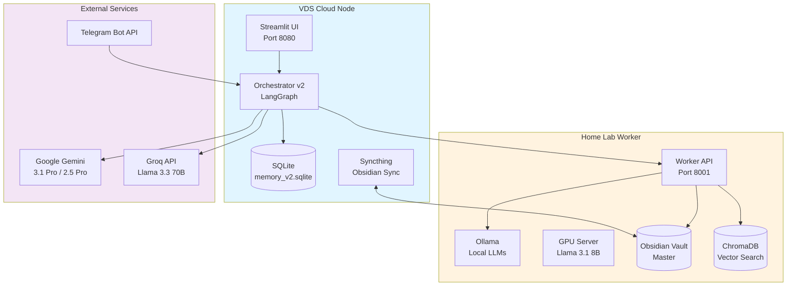
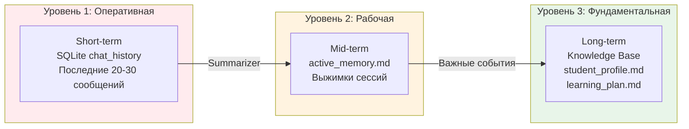
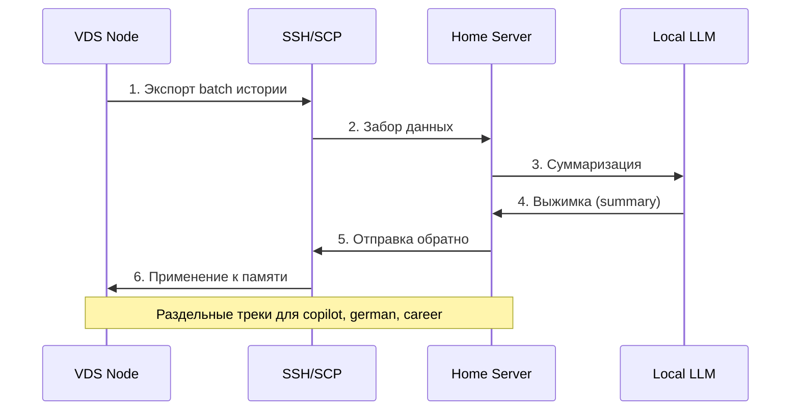
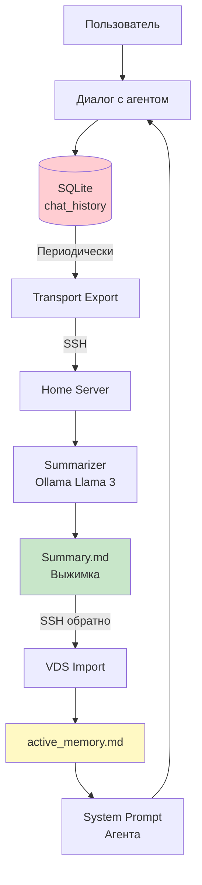
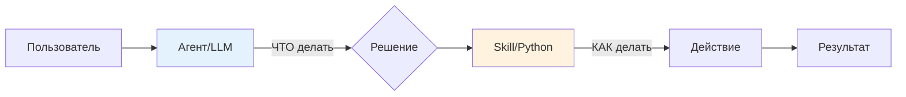
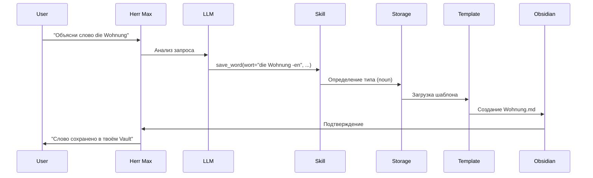
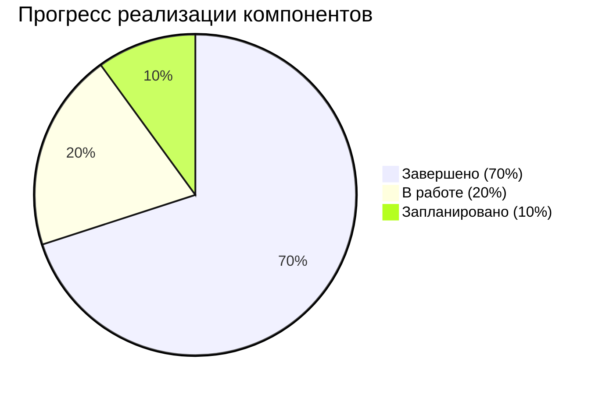

# 🧠 Обзор проекта Personal Agents (Antigravity)

**Дата анализа:** 2026-04-25  
**Статус:** Production (VDS + Home Lab)  
**Цель документа:** Комплексное описание архитектуры для будущего развития

---

## 📋 Оглавление

1. [Общая концепция](#общая-концепция)
2. [Архитектура системы](#архитектура-системы)
3. [Ключевые компоненты](#ключевые-компоненты)
4. [Структура проекта](#структура-проекта)
5. [Система памяти](#система-памяти)
6. [Транспортный слой](#транспортный-слой)
7. [Skills Architecture](#skills-architecture)
8. [Агенты системы](#агенты-системы)
9. [Технологический стек](#технологический-стек)
10. [Текущий статус и планы](#текущий-статус-и-планы)

---

## Общая концепция

**Personal Agents** — гибридная мультиагентная ИИ-платформа, объединяющая облачные вычисления (VDS) и локальные ресурсы (Home Lab) в единую экосистему. Основана на концепции **Multi-Agent RAG** для управления персональными знаниями через Obsidian.

### Ключевые принципы

1. **Приватность прежде всего**: Конфиденциальные данные никогда не покидают частный контур
2. **Гибридная архитектура**: VDS для оркестрации, Home Lab для тяжелых вычислений
3. **Модульность**: Skills-based архитектура с независимыми компонентами
4. **Долговременная память**: Трёхуровневая система памяти для агентов
5. **Zero-downtime**: 24/7 доступность через облачный узел

---

## Архитектура системы

### Общая схема инфраструктуры



### Распределение ролей

**VDS (Облачный узел)**
- Легковесный оркестратор (< 500MB RAM)
- Streamlit UI с защитой через Authelia
- Telegram Bot для мобильного доступа
- Хранение истории диалогов (SQLite)
- Симуляция Obsidian Vault для работы агентов

**Home Lab (Рабочий узел)**
- Локальные LLM на GPU (Ollama)
- Векторный поиск по полному Obsidian Vault (ChromaDB)
- Суммаризация истории диалогов (Summarizer)
- Генерация выжимок для долговременной памяти
- Обработка конфиденциальных данных

---

## Ключевые компоненты

### 1. Оркестратор (orchestrator_v2.py)

Центральный компонент на базе **LangGraph** для управления мультиагентными workflow.

**Основные функции:**
- Маршрутизация запросов между агентами
- Управление историей диалогов
- Динамическое переключение LLM моделей
- Интеграция инструментов (tools) для каждого агента
- Персистентность настроек пользователей

**Ключевые сущности:**
```python
# Типизация состояния агента
class AgentState(TypedDict):
    messages: List[BaseMessage]
    agent_type: str
    model_override: Optional[str]
    user_id: str

# Реестр агентов
AGENT_REGISTRY = {
    'general': '🤖 Помощник',
    'german': '🇩🇪 Herr Max Klein',
    'career': '💼 HR-Эксперт',
    'finance': '💰 Финансы',
    'vds_admin': '🌐 VDS Admin',
    'local_admin': '🏠 Local Admin'
}
```

### 2. Система памяти (Memory System)

Трёхуровневая архитектура памяти для сохранения контекста между сессиями.



**Компоненты:**

- **[`summarizer.py`](Agents/core/memory_system/summarizer.py)**: Локальная суммаризация через Ollama
- **[`active_memory.md`](Agents/history/copilot/active_memory.md)**: Текущее состояние проекта для Copilot
- **[`session_snapshot.py`](Agents/core/memory_system/session_snapshot.py)**: Снимки сессий для транспорта

### 3. Транспортный слой (Transport Layer)

Система синхронизации runtime-данных между VDS и Home без использования Git.

**Структура папок:**
```
runtime_sync/
├── export/          # VDS → Home (экспорт)
│   ├── copilot/
│   ├── german/
│   ├── career/
│   └── infra/
├── import/          # Home → VDS (импорт)
│   ├── copilot/
│   ├── german/
│   ├── career/
│   └── infra/
└── state/           # Состояние синхронизации
    ├── copilot.json
    ├── german.json
    ├── career.json
    └── infra.json
```

**Компоненты:**

- **[`common.py`](Agents/core/transport/common.py)**: Общие утилиты, маскирование секретов
- **[`pull_snapshot_from_vds.py`](Agents/core/transport/pull_snapshot_from_vds.py)**: Забор snapshot с VDS
- **[`push_summary_to_vds.py`](Agents/core/transport/push_summary_to_vds.py)**: Отправка summary обратно
- **[`process_incoming_batch.py`](Agents/core/transport/process_incoming_batch.py)**: Обработка входящих batch
- **[`export_vds_batch.py`](Agents/core/transport/export_vds_batch.py)**: Экспорт с VDS

**Workflow транспорта:**



### 4. Skills Architecture

Модульная система навыков для агентов, разделяющая логику инструкций (LLM) от реализации (Python).

**Принципы:**
- **Model** решает ЧТО делать
- **Skill** решает КАК это делать

**Структура:**
```
core/skills/
├── german_teacher.py    # Интерфейс учителя
├── german_storage.py    # Логика работы с Obsidian
└── (future skills)
```

**Пример skill:**

```python
class GermanTeacherSkills:
    def __init__(self, workspace_root=None):
        self.storage = GermanStorage(workspace_root)
        self.is_vds = self.storage.is_vds
    
    def save_word(self, wort, uebersetzung, beispiel_1, ...):
        """Сохранение слова по шаблону в Obsidian"""
        data = {...}
        return self.storage.save_word(data)
```

**German Storage:**
- Автоопределение режима (VDS vs Home)
- Обработка артиклей и плюралей
- Работа с шаблонами Obsidian
- Slug generation для имён файлов

---

## Структура проекта

### Основные директории

```
Agents/
├── app.py                      # Streamlit UI (точка входа)
├── bot.py                      # Telegram Bot (опционально)
├── config.py                   # Централизованная конфигурация
├── docker-compose.yml          # VDS deployment
├── docker-compose.local.yml    # Home Lab deployment
├── Dockerfile
│
├── core/                       # Ядро системы
│   ├── orchestrator_v2.py      # LangGraph оркестратор
│   ├── admin_tools.py          # Системные инструменты
│   ├── utils_obsidian.py       # Работа с Obsidian
│   ├── worker_api.py           # API для Home Worker
│   │
│   ├── memory_system/          # Система памяти
│   │   ├── summarizer.py
│   │   └── session_snapshot.py
│   │
│   ├── skills/                 # Модульные навыки
│   │   ├── german_teacher.py
│   │   └── german_storage.py
│   │
│   └── transport/              # Транспортный слой
│       ├── common.py
│       ├── pull_snapshot_from_vds.py
│       ├── push_summary_to_vds.py
│       ├── process_incoming_batch.py
│       └── export_vds_batch.py
│
├── knowledge/                  # База знаний (VDS)
│   ├── init_brain.md
│   ├── checkpoint_2026_04_08.md
│   ├── german/                 # Профили учеников
│   │   ├── learning_plan.md
│   │   ├── student_profile.md
│   │   └── _templates/
│   └── methodology/            # Методологии разработки
│
├── history/                    # Архив и логи
│   └── copilot/
│       ├── active_memory.md
│       ├── memory_concept.md
│       └── session_checklist.md
│
├── plans/                      # Планы и архитектура
│   ├── deployment_plan.md
│   ├── project_structure.md
│   ├── skills_architecture.md
│   ├── copilot/
│   │   ├── project_roadmap.md
│   │   └── runtime_transport_rollout.md
│   └── agents/german/
│
├── obsidian_vault_simulation/  # Симуляция для VDS
│   └── knowledge/german/
│       ├── words/
│       ├── phrases/
│       └── grammar/
│
├── runtime_sync/               # Транспортные данные
│   ├── export/
│   ├── import/
│   └── state/
│
└── data/                       # Персистентные данные
    └── memory_v2.sqlite
```

### Ключевые файлы конфигурации

**[`.env`](Agents/.env.example)** - Переменные окружения:
```bash
TELEGRAM_BOT_TOKEN=...
GOOGLE_API_KEY=...
GROQ_API_KEY=...
OBSIDIAN_VAULT_PATH=/app/obsidian
SQLITE_DB_PATH=/app/data/memory_v2.sqlite
OLLAMA_BASE_URL=http://home-server:11434
REMOTE_WORKER_URL=http://home-server:8001
```

**[`config.py`](Agents/config.py)** - Централизованная конфигурация через Pydantic:
```python
class Settings(BaseSettings):
    telegram_bot_token: str
    groq_api_key: str
    google_api_key: str
    obsidian_vault_path: str
    local_server_url: str
    # ...
```

---

## Система памяти

### Схема работы памяти



### Компоненты памяти

#### 1. Оперативная память (SQLite)

**Таблица `chat_history`:**
```sql
CREATE TABLE chat_history (
    id INTEGER PRIMARY KEY,
    user_id TEXT,
    agent_type TEXT,
    role TEXT,              -- 'user' | 'assistant'
    content TEXT,
    timestamp DATETIME,
    model_name TEXT,
    deleted_at DATETIME     -- Мягкое удаление
);
```

**Таблица `agent_settings`:**
```sql
CREATE TABLE agent_settings (
    user_id TEXT,
    agent_type TEXT,
    setting_key TEXT,       -- Например: 'selected_model'
    setting_value TEXT,
    PRIMARY KEY (user_id, agent_type, setting_key)
);
```

#### 2. Рабочая память (Active Memory)

**[`active_memory.md`](Agents/history/copilot/active_memory.md)** - структура:

```markdown
## 📍 ТЕКУЩАЯ ТОЧКА (Where are we?)
**Дата:** ...
**Сессия:** ...
**Статус:** ...

## 🚦 ПРИОРИТЕТЫ В РАБОТЕ
1. [ACTIVE] ...
2. [NEXT] ...

## 📎 ПОСЛЕДНИЕ РЕШЕНИЯ (ADR)
- **Решение 1**: ...

## 🗒 ЖУРНАЛ ВЫПОЛНЕНИЯ
- [x] Завершено
- [ ] В работе
```

#### 3. Фундаментальная память (Knowledge Base)

Структурированные документы в [`knowledge/`](Agents/knowledge/):
- **[`init_brain.md`](Agents/knowledge/init_brain.md)**: Базовые принципы системы
- **[`checkpoint_2026_04_08.md`](Agents/knowledge/checkpoint_2026_04_08.md)**: Критические контрольные точки
- **`german/student_profile.md`**: Профиль ученика для Herr Max Klein
- **`german/learning_plan.md`**: План обучения немецкому

---

## Транспортный слой

### Фазы реализации (из roadmap)

#### ✅ Фаза 1: Локальная реализация (Completed)
- Создана структура `core/transport/`
- Реализованы базовые скрипты
- Локальное dry-run тестирование

#### 🔄 Фаза 2: VDS интеграция (In Progress)
- Настройка SSH транспорта
- Тестирование циклов туда-обратно
- Разделение треков (copilot, german, career)

#### 📋 Фаза 3: Инкрементальный режим (Planned)
- Delta-sync по `last_id`
- Защита от дублей
- Идемпотентность операций

#### 📋 Фаза 4: Skills интеграция (Planned)
- Транспорт как часть service-архитектуры
- Подключение к агентам через единый интерфейс

### Правила безопасности транспорта

1. **Никогда**: Не отправлять секреты в summary
2. **Никогда**: Не публиковать runtime-данные в GitHub
3. **Всегда**: Маскировать токены/ключи/пароли
4. **Всегда**: Разделять контексты агентов
5. **Всегда**: Идемпотентные операции

### Маскирование секретов

```python
# common.py
SECRET_PATTERNS = [
    re.compile(r'sk-[a-zA-Z0-9]{32,}'),     # OpenAI
    re.compile(r'ghp_[a-zA-Z0-9]{36}'),     # GitHub
    re.compile(r'password\s*[:=]\s*[^\s]+'),
]

def mask_secrets(text: str) -> str:
    for pattern in SECRET_PATTERNS:
        text = pattern.sub("[MASKED]", text)
    return text
```

---

## Skills Architecture

### Концепция разделения

**Проблема старого подхода:**
- Сложные правила форматирования в System Prompt
- Модель может галлюцинировать пути и форматы
- Дублирование логики между агентами

**Решение - Skill-Centric:**



### Примеры Skills

#### German Teacher Skills

**Интерфейс ([`german_teacher.py`](Agents/core/skills/german_teacher.py)):**
```python
class GermanTeacherSkills:
    def save_word(self, wort, uebersetzung, beispiel_1, ...):
        """Модель вызывает этот tool, передавая параметры"""
        data = {...}
        return self.storage.save_word(data)
    
    def save_phrase(self, phrase, uebersetzung, context, ...):
        """Сохранение фразы"""
        pass
    
    def update_learning_plan(self, goals, focus):
        """Обновление плана обучения"""
        pass
```

**Логика ([`german_storage.py`](Agents/core/skills/german_storage.py)):**
- Автоопределение VDS vs Home режима
- Работа с шаблонами Obsidian
- Обработка немецких специфик (артикли, умлауты)
- Генерация безопасных имён файлов

**Детектор типа слова:**
```python
def detect_word_type(self, wort_raw: str) -> Tuple[str, str]:
    # 1. Существительное: "der Tisch", "die Wohnung"
    if re.match(r'^(der|die|das)\s+', wort):
        return 'noun', clean_name
    
    # 2. Глагол: "gehen, geht, ging"
    if ',' in wort and wort.endswith('en'):
        return 'verb', infinitiv
    
    # 3. Другое
    return 'other', clean_name
```

#### Infrastructure Skills (Planned)

Универсальные инструменты для контроля серверов:

```python
def get_system_status(target: str):  # 'vds' или 'local'
    """CPU, RAM, Disk"""
    pass

def manage_docker_container(target: str, name: str, action: str):
    """Start/Stop/Restart контейнеров"""
    pass

def check_network_latency(target: str):
    """Проверка связи между узлами"""
    pass
```

---

## Агенты системы

### Реестр агентов

```python
AGENT_REGISTRY = {
    'general': {
        'name': '🤖 Помощник',
        'desc': 'Общие вопросы и поиск в Obsidian',
        'model': 'llama-3.3-70b-versatile',  # Groq
        'tools': []
    },
    'german': {
        'name': '🇩🇪 Herr Max Klein',
        'desc': 'Учитель немецкого языка',
        'model': 'gemini-2.5-pro',
        'tools': [
            'save_word',
            'save_phrase',
            'update_learning_plan',
            'obsidian_capture_tool'
        ]
    },
    'career': {
        'name': '💼 HR-Эксперт',
        'desc': 'Консультант по трудоустройству',
        'model': 'gemini-2.5-pro',
        'tools': ['obsidian_capture_tool']
    },
    'vds_admin': {
        'name': '🌐 VDS Admin',
        'desc': 'Управление Docker и мониторинг',
        'tools': [
            'get_docker_status',
            'check_connection',
            'run_remote_command'
        ]
    },
    'local_admin': {
        'name': '🏠 Local Admin',
        'desc': 'Управление локальным сервером',
        'tools': [
            'get_docker_status',
            'check_connection',
            'run_remote_command'
        ]
    }
}
```

### Herr Max Klein (German Teacher)

**Основной агент для обучения немецкому языку.**

**Возможности:**
- Сохранение слов с артиклями и примерами
- Сохранение фраз с контекстом использования
- Обновление плана обучения
- Интервальное повторение (Planned)

**System Prompt:**
```text
Ты Herr Max Klein, опытный преподаватель немецкого языка 
использующий современные, проверенные и эффективные методики 
для обучения.
```

**Workflow:**


**Структура данных Obsidian:**
```markdown
---
title: die Wohnung
type: noun
artikel: die
plural: Wohnungen
created: 2026-04-25 12:30
tags: [german, vocabulary, housing]
---

# die Wohnung

**Перевод:** квартира

**Множественное число:** Wohnungen

## Примеры использования

1. Ich suche eine neue Wohnung.
   > Я ищу новую квартиру.

2. Die Wohnung hat drei Zimmer.
   > Квартира имеет три комнаты.
```

---

## Технологический стек

### Backend & Orchestration

| Компонент | Технология | Назначение |
|-----------|-----------|-----------|
| **Orchestrator** | LangGraph | Stateful multi-agent workflows |
| **Framework** | LangChain | LLM интеграции и tools |
| **Backend** | Python 3.10+ | Основной язык |
| **API** | FastAPI | Worker API для Home Lab |
| **Web Server** | Uvicorn | ASGI сервер |

### LLM Ecosystem

| Модель | Провайдер | Использование |
|--------|----------|---------------|
| **Gemini 3.1 Pro** | Google | Сложные задачи, Deep reasoning |
| **Gemini 2.5 Pro/Flash** | Google | Production агенты |
| **Gemini 2.0 Flash** | Google | Быстрые ответы |
| **Llama 3.3 70B** | Groq | Общий помощник (скорость) |
| **Llama 3.1 70B** | Groq | Backup model |
| **Llama 3.1 8B** | Ollama (Local) | Summarizer, приватные задачи |
| **Mistral Nemo 12B** | Ollama (Local) | Локальные эксперименты |

### Storage & Database

| Компонент | Технология | Назначение |
|-----------|-----------|-----------|
| **RDBMS** | SQLite3 | История чатов, настройки |
| **Vector DB** | ChromaDB | Индексация Obsidian Vault |
| **Knowledge Base** | Obsidian (Markdown) | Структурированные знания |
| **File Sync** | Syncthing | Синхронизация Obsidian VDS↔Home |

### Infrastructure

| Компонент | Технология | Назначение |
|-----------|-----------|-----------|
| **Containerization** | Docker & Docker Compose | Изоляция сервисов |
| **Reverse Proxy** | Traefik | SSL, маршрутизация |
| **Authentication** | Authelia | Single Sign-On для UI |
| **VPN** | WireGuard | Защищенная связь VDS↔Home |
| **Transport** | SSH/SCP | Runtime-данные без Git |

### UI/UX

| Компонент | Технология | Назначение |
|-----------|-----------|-----------|
| **Web UI** | Streamlit | Admin dashboard |
| **Mobile** | Telegram Bot API | Мобильный доступ |
| **Voice** | FFmpeg + TTS | Голосовые ответы |

### Development & DevOps

| Компонент | Технология | Назначение |
|-----------|-----------|-----------|
| **Config** | Pydantic Settings | Валидация конфигурации |
| **Env Management** | python-dotenv | Переменные окружения |
| **Type Checking** | Python typing | Статическая типизация |
| **Package Management** | pip + requirements.txt | Зависимости |

---

## Текущий статус и планы

### Статус компонентов



#### ✅ Завершено (Production-ready)

- [x] Оркестратор v2 с LangGraph
- [x] Мультиагентная система (6 агентов)
- [x] Динамическое переключение моделей
- [x] SQLite персистентность
- [x] Streamlit UI с Telegram-style
- [x] Docker deployment (VDS + Local)
- [x] Syncthing интеграция
- [x] German Teacher базовые skills
- [x] Obsidian capture tool
- [x] Admin tools (Docker management)
- [x] Summarizer локальный

#### 🔄 В работе (In Progress)

- [ ] Transport Layer интеграция VDS↔Home
- [ ] Memory System v2 (трёхуровневая)
- [ ] Skills Architecture унификация
- [ ] German Teacher: интервальное повторение
- [ ] ChromaDB RAG для полного Vault

#### 📋 Запланировано (Roadmap)

- [ ] Career Agent: резюме и вакансии
- [ ] Finance Agent: учёт расходов
- [ ] Automated testing suite
- [ ] Performance monitoring
- [ ] Multi-user support
- [ ] Voice interface enhancement

### Roadmap по приоритетам

#### 🏗️ Направление 1: Copilot Memory (25%)
**Цель:** Чтобы GitHub Copilot не забывал архитектурные решения между сессиями.

- [x] Создание структуры `active_memory.md`
- [ ] Чек-лист сессии
- [ ] Автоматизация обновления памяти
- [ ] Тестирование после перезапуска

#### 🤖 Направление 2: Summarizer (30%)
**Цель:** Очищать SQLite историю, оставляя выжимку.

- [x] Набросок скрипта `summarizer.py`
- [ ] Настройка подключения к Ollama
- [ ] Логика обработки и очистки
- [ ] Тестирование на Home Server

#### 🚚 Направление 2B: Transport Layer (50%)
**Цель:** Передача runtime-данных напрямую по SSH без GitHub.

- [x] Blueprint в `runtime_transport_rollout.md`
- [x] Реализация Фазы 1 локально
- [ ] Перенос на VDS
- [ ] Тестирование цикла туда-обратно
- [ ] Разделение треков для агентов

#### 🛠 Направление 3: Skills Architecture (10%)
**Цель:** Модульная система вместо костылей.

- [x] Создание папки `/core/skills/`
- [ ] Базовый класс `BaseSkill`
- [ ] `skill_file_manager.py`
- [ ] Тестирование через оркестратор

#### 🇩🇪 Направление 4: Herr Max Klein (0%)
**Цель:** Полноценный учитель с интервальным повторением.

- [ ] Атомарные планы по темам
- [ ] `skill_vocab_trainer.py` (Anki-style)
- [ ] Обновление системного промпта
- [ ] Тестовый урок с повторением

### Метрики проекта

**Размер кодовой базы:**
- Python файлов: ~30
- Строк кода: ~5000+
- Markdown документов: 20+
- Docker services: 3 (UI, Syncthing, Worker)

**Производительность:**
- VDS RAM usage: < 500MB
- UI startup time: ~3 секунды
- Model switch: Instant (без перезагрузки)
- Groq response time: < 1 секунда

**Инфраструктура:**
- VDS: 24/7 uptime
- Home Lab: On-demand
- Sync latency: < 30 секунд
- SSL: Let's Encrypt auto-renewal

---

## Ключевые принципы разработки

### 1. Безопасность и приватность

- **Никогда** не логировать API-ключи или токены
- **Всегда** маскировать секреты перед записью
- **Использовать** локальные модели для конфиденциальных данных
- **Изолировать** данные агентов друг от друга

### 2. Масштабируемость

- **Модульная** архитектура (skills, transport, agents)
- **Stateless** оркестратор с персистентностью в SQLite
- **Горизонтальное** масштабирование через Worker Nodes
- **Кеширование** на каждом уровне

### 3. Надежность

- **Мягкое удаление** вместо hard delete
- **Идемпотентные** операции в транспорте
- **Graceful degradation** при недоступности узлов
- **Retry logic** для критических операций

### 4. Поддерживаемость

- **Чистая** структура папок
- **Документирование** архитектурных решений
- **Долговременная** память для контекста
- **Type hints** для всех функций

---

## Полезные ссылки и команды

### Запуск системы

**VDS (Cloud):**
```bash
cd /path/to/Agents
docker compose up -d --build
```

**Home Lab (Worker):**
```bash
cd /path/to/Agents
docker compose -f docker-compose.local.yml up -d --build
```

**Локальная разработка:**
```bash
# Windows
run_ui.bat
run_bot.bat

# Linux/Mac
streamlit run app.py
python bot.py
```

### Управление

**Просмотр логов:**
```bash
docker compose logs -f ui
docker compose logs -f syncthing
```

**Перезапуск сервиса:**
```bash
docker compose restart ui
```

**Проверка статуса:**
```bash
docker compose ps
docker stats
```

### Транспорт

**Ручной запуск summarizer:**
```bash
docker exec -it antigravity_worker python core/memory_system/summarizer.py
```

**Синхронизация runtime-данных:**
```bash
# На Home Server
cd core/transport
bash sync_all.sh
```

### Полезные файлы

- [README.md](Agents/README.md) - Главная документация
- [deployment_plan.md](Agents/plans/deployment_plan.md) - План деплоя
- [skills_architecture.md](Agents/plans/skills_architecture.md) - Архитектура skills
- [runtime_transport_rollout.md](Agents/plans/copilot/runtime_transport_rollout.md) - План транспорта
- [project_roadmap.md](Agents/plans/copilot/project_roadmap.md) - Дорожная карта

---

## Заключение

**Personal Agents** - это зрелая гибридная мультиагентная система с продуманной архитектурой:

✅ **Работает**: Production-ready на VDS с 24/7 доступом  
✅ **Безопасно**: Приватные данные остаются локально  
✅ **Масштабируемо**: Легко добавлять новые агенты и skills  
✅ **Документировано**: Детальная память и планы развития  

**Следующие шаги для развития:**

1. Завершить Transport Layer (Фаза 2)
2. Внедрить полную Memory System v3
3. Развить German Teacher с интервальным повторением
4. Унифицировать Skills Architecture
5. Добавить автоматическое тестирование

**Контакты и информация:**
- Репозиторий: `git@github.com:user/AntigravityAgents.git`
- VDS URL: `https://agents.eurostick.com.ua`
- Syncthing: `https://sync-agents.eurostick.com.ua`

---

*Документ создан: 2026-04-25*  
*Автор: AI Architect (Claude Sonnet 4.5)*  
*Версия: 1.0*
